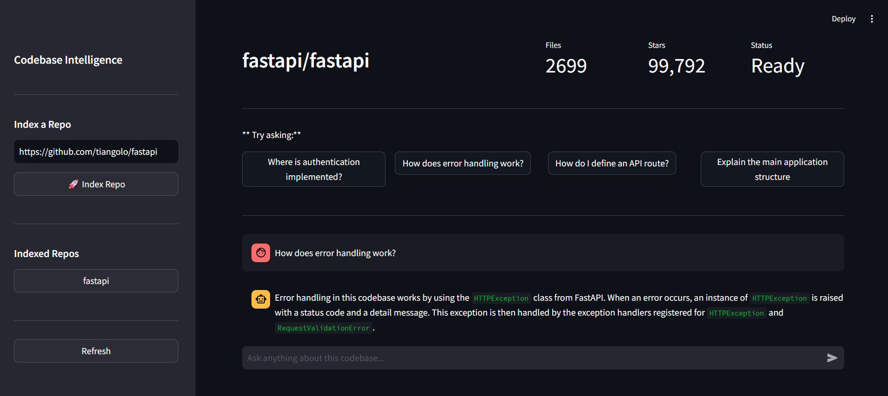

# 🧠 GitHub Codebase Intelligence Platform

> Ask natural language questions about any GitHub repository using AI.


## 🌐 Live Demo
- **App:** https://repo-intelligence.streamlit.app
- **API Docs:** https://github-intelligence-production.up.railway.app/docs

## 📸 Demo



## 🎯 What It Does

Developers joining a new project spend **weeks** understanding the codebase.
This tool lets you ask plain English questions and get instant, accurate answers:

- *"Where is authentication implemented?"*
- *"How does error handling work?"*
- *"Explain the payment flow"*
- *"How do I define an API route?"*

## 🏗️ Architecture

```
User (Streamlit UI)
        ↓
FastAPI Backend
        ↓
┌─────────────────────────────────────┐
│  GitHub API  │  MySQL   │  ChromaDB │
│  (fetch code)│(metadata)│ (vectors) │
└─────────────────────────────────────┘
        ↓
   RAG Pipeline
        ↓
Groq (qwen/qwen3.8-27b)
        ↓
Answer + File Citations
```

## 🛠️ Tech Stack

| Layer | Technology | Purpose |
|---|---|---|
| Frontend | Streamlit | Chat UI |
| Backend | FastAPI | REST API |
| Database | MySQL + SQLAlchemy | Repo & file metadata |
| RAG Framework | LangChain | Text splitter, embeddings, vector store, prompt + LLM chain |
| Vector Store | ChromaDB | Code embeddings |
| Embeddings | sentence-transformers | Free local model (via LangChain HuggingFaceEmbeddings) |
| LLM | Groq (qwen/qwen3.8-27b) | Answer generation (via LangChain ChatGroq) |
| GitHub | PyGithub | Repo fetching |

## 🚀 Quick Start

### 1. Clone the repo
```bash
git clone https://github.com/YOUR_USERNAME/github-intelligence.git
cd github-intelligence
```

### 2. Create virtual environment
```bash
python -m venv venv
venv\Scripts\activate  # Windows
source venv/bin/activate  # Mac/Linux
```

### 3. Install dependencies
```bash
pip install -r requirements.txt
```

### 4. Set up environment variables
```bash
cp .env.example .env
# Edit .env with your actual API keys
```

### 5. Create MySQL database
```sql
CREATE DATABASE github_intel;
```

### 6. Run the backend
```bash
cd backend
uvicorn main:app --reload --port 8000
```

### 7. Run the frontend
```bash
cd frontend
streamlit run app.py
```

### 8. Open your browser
- **Frontend:** http://localhost:8501
- **API Docs:** http://localhost:8000/docs

## 📖 How It Works

1. **Index** — Paste any GitHub URL → app fetches all code files via GitHub API
2. **Chunk** — File content split into overlapping chunks with LangChain's text splitter
3. **Embed** — Each chunk converted to a vector using sentence-transformers (LangChain HuggingFaceEmbeddings)
4. **Search** — User question converted to vector, ChromaDB (LangChain Chroma) finds similar chunks
5. **Answer** — A LangChain chain (prompt → Groq LLM → parser) reads relevant chunks → generates accurate answer with citations

## 🔑 Environment Variables

| Variable | Description |
|---|---|
| `GITHUB_TOKEN` | GitHub Personal Access Token |
| `GROQ_API_KEY` | Groq API Key (free at console.groq.com) |
| `DATABASE_URL` | MySQL connection string |

## 📁 Project Structure

```
github-intelligence/
├── backend/
│   ├── main.py            # FastAPI server
│   ├── github_loader.py   # GitHub API fetching
│   ├── database.py        # MySQL models + queries
│   ├── indexer.py         # Repo indexing pipeline
│   ├── chunker.py         # File content chunking
│   ├── embedder.py        # Embeddings + ChromaDB
│   └── rag.py             # RAG pipeline
├── frontend/
│   └── app.py             # Streamlit UI
├── .env.example           # Environment template
├── requirements.txt       # Dependencies
└── README.md
```

## 🎓 Skills Demonstrated

- **RAG Pipeline** — Retrieval Augmented Generation built with LangChain
- **Vector Embeddings** — Semantic code search with ChromaDB
- **REST API Design** — FastAPI with async background tasks
- **SQL Database** — MySQL schema design with SQLAlchemy ORM
- **API Integration** — GitHub API with pagination + rate limiting
- **Full Stack** — End-to-end Python ML application

## 📄 License

MIT License — feel free to use this for your own projects!